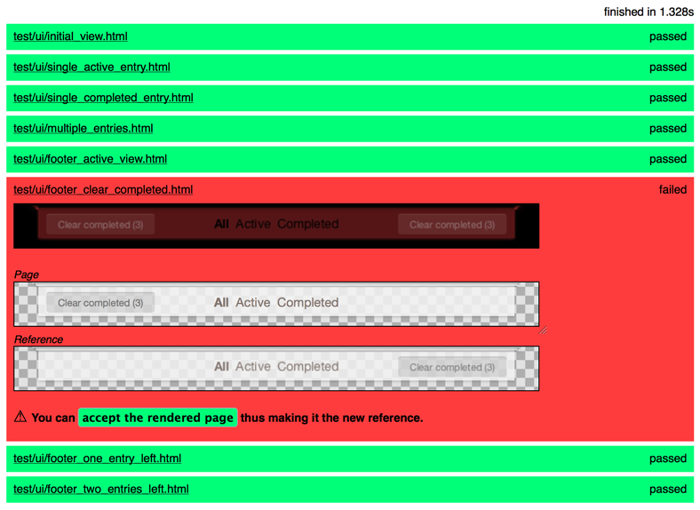
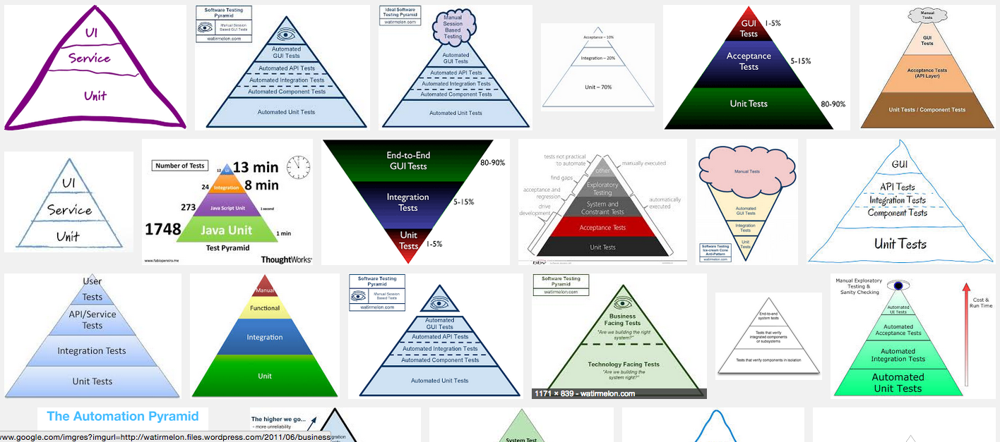

class: center middle

# Hi :-)

---

# Towards a Theory & Methodology of Test-Driven Design

Jonathan Berger, 2015

Mobile Central Europe, Warsaw

---

## Who Am I?

- [@jonathanpberger](http://jonathanpberger.com)
- design, code, pm
- ~30 agile projects since 2008
- interested in agile practice for design

---

## Who are you?
Show of hands:

--

- Designer?
--

- Developer?
--

- What else?
---


## What it says on the tin

> Years ago, Developers had problems and devised Agile techniques to address them. Today, Designers face similar problems. Can we adopt similar techniques? In this talk, we’ll explore what automated testing might look like for design. What would it look like to have a more defined definition of “done” for design? What if designers could refactor with impunity? We’ll explore testing possibilities for Visual design, User Experience design, and front-end engineering, and try to build a testing pyramid for design.

---

## Hypotheses

1. Design practice can learn from Agile Development
--

2. BUT it's not an exact 1:1 mapping
--

3. The [Next Biggest Boulder][boulder] in the road: **casting emerging tools in the context of a coherant practice.**

---

<!-- 
# Goal of this Talk
- Share the state of the art for Design Testing
- Suggest the possibilities for TDD for design
- Argue that we need more than tools: we need process

-->

## Agenda
- Agile and Design and Testing
- Theory of TDDesign: Why is it Useful?
- Methodology of TDDesign: How might it be done?
- Next Steps

---

class: center, middle, warning

## WARNING: "Testing" is a messy word.

???

- In the design context, it usually means User Testing
- User Testing is a part of this, but we're talking about a lot more

---

class: center, middle

.f2[Testing &ne; User Testing]

---

class: center, middle

.f2[Testing &sup; User Testing]

---

class: center, middle

.f2[Testing &ne; TDD]

---

class: center, middle

.f2[Testing &sup; TDD]

---

class: center, middle, inverse
# Agile + Testing + Design

---

class: center, middle
.f2[Once upon a time...]

---

class: center, middle
name: developer-problems

## Developers had problems

---

background-image: url(images/principles.png)

---
class: middle, center

## (Shorter) [Principles Behind the Agile Manifesto](http://www.agilemanifesto.org/principles.html)

---

class: center, middle, warning

.f1[Things Hurt!!]

---

### Things that hurt

- Changing requirements
- "Seagull" management
- Low-fidelity communication
- Doing unnecessary work
- Infrequent delivery
- Slow-to-evolve process
- Unsustainable pace

???

Through a very scientific process, the list was consolidated

---

### Things that hurt

- .de-em[Changing requirements, e.g.] **backlog churn**
- .de-em["Seagull" management, e.g]. **swoop in, poop all over, fly away**
- .de-em[Low-fidelity communication, e.g.] **not knowing what to build**
- .de-em[Doing unnecessary work, e.g.] **building the wrong thing**
- .de-em[Infrequent delivery, e.g.] **monthly or quarterly or NEVER releases**
- .de-em[Slow-to-evolve process, e.g.] **broken process**
- .de-em[Unsustainable pace, e.g.] **late nights, weekends**

---

### The Result
- Time is wasted on distractions
- Motivation wanes
- Cost of change is high
- Customers aren't satisfied

---

### The Result

- .de-em[Time is wasted on distractions, e.g.] **"What are they doing?!"**
- .de-em[Motivation wanes, e.g.] **we're bored and upset**
- .de-em[Cost of change is high, e.g.] **product is unresponsive**
- .de-em[Customers aren't satisfied, e.g.] **FAILURE AND MISERY!!**

---

class: center, middle, warning

.f1[

SPOILER ALERT!!

]

???

We've been talking about a 20-year old engineering story, but

---

class: center, middle, inverse

.f1[

Designers have many of the same problems today!!

]

---
class: center, middle
.f2[(back to developers)]

???

the devs' response?

---
name: agile-manifesto
background-image: url(images/agile-manifesto.png)

---

name: agile-in-practice
class: center, middle

.f2[What does "Agile" mean in practice?]

---

## Agile Development in practice

.left-third[
.f3[Continuously]

optimize for...

- **Outside-In** dev't
- low **Cost Of Change**
- tight **feedback loops** with {users, business, product}
]

.middle-third[
.f3[Weekly Cadence]

- Retros
- Iteration Planning
- Release planning

]

.right-third[

.f3[Daily Cadence]

- Standups
- Pair Programming
- Test-Driven Dev't ("TDD")
- Continuous Integration ("CI")

]

---

background-image: url(images/jay-z.jpg)
class: center, middle, inverse

.f1[Designers have Problems]

---

class: center, middle

.f1[How can testing help?]

---

## \#DesignProblems

- Brittle styles .de-em[at the implementation (e.g. CSS) layer]
- Unintended design regressions .de-em[(especially in cross-browser or responsive contexts)]
- Trouble abstracting design decisions .de-em[from affordances and spandrals; i.e., Cargo Culting Design]
- Trouble defining "done" .de-em[for a design]

???

USING A HASHTAG!!

---

### Designers hurt too

- .de-em[Changing requirements, e.g.] **backlog churn**
- .de-em["Seagull" management, e.g]. **swoop in, poop all over, fly away**
- .de-em[Low-fidelity communication, e.g.] **not knowing what to .green[design]**
- .de-em[Doing unnecessary work, e.g.] **.green[designing] the wrong thing**
- .de-em[Infrequent delivery, e.g.] **monthly or quarterly or NEVER releases**
- .de-em[Slow-to-evolve process, e.g.] **broken process**
- .de-em[Unsustainable pace, e.g.] **late nights, weekends**

---

### Designers see similar results

- .de-em[Time is wasted on distractions, e.g.] **"What are they doing?!"**
- .de-em[Motivation wanes, e.g.] **we're bored and upset**
- .de-em[Cost of change is high, e.g.] **product is unresponsive**
- .de-em[Customers aren't satisfied, e.g.] **FAILURE AND MISERY!!**

---

name: in-practice
## What Could Agile Design mean in practice?

.left-third[
### Continuously

- User-Centered Design
- Design systems, not pages ([Atomic Design][atomic])
- Research & User Testing
]

.middle-third[
### Weekly Cadence

- Standups: YES!
- Retros: YES!!
- Design stories, backlog
- [Big Design Refactor][bdr]
]

.right-third[
### Daily Cadence

- Pairing: YES!
- **TDD: this talk**
- **CI: next talk**
]

???

design : dev ::

weekly

- User-Centered Design &larr; Outside-In Development
- Design systems, not pages &larr; Low Cost of Change
- Tight Feedback Loops &rarr; Research, User Testing

daily

- IPMs &rarr; Storywriting
- Release Planning &rarr; [Big Design Refactor][3]

---
class: center, middle

## What might automated testing look like for design?

---
name: csstest
### Some people are working on this
<http://CSSTe.st> catalogs a number of techniques for testing CSS:

- Computed Style
- Frozen DOM
- House styleguide
- Image diff
- Project styleguide
- Reference browser comparison
- Syntax checks

???

This is their list

---

### Tend to be focused on a few approaches

- Screenshot Diff'ing
- Unit Testing CSS
- Linting

---

### Screenshot Diff'ing

.de-em[Examples using [Wraith][wraith] and [CSS Critic][csscritic]]

.left-column[]
.right-column[

]

---

### Unit Testing CSS
.de-em[example using [Hardy.io][hardy]]

```ruby
Feature: Website layout test
As a user I want visual consistency on the http://csste.st/ website

Scenario: Content layout
Given I visit "http://csste.st/"
Then "section > p" should have "color" of "rgb(68, 68, 68)"
```

---

### Linting
.de-em[example using [CSS Lint][csslint]]


---

name:fixtures
## A word about Fixtures

- Content changes make many of these techniques are brittle
- TDD has addressed this with Fixtures
- Some work on Design [Fixtures][fixtures] can help a *lot*

---

class: center, middle, inverse

## Automation is key

---

### What're the goals here?

1. Brittle styles at the implementation layer (CSS)
2. Unintended design regressions (especially in cross-browser or responsive contexts)
3. trouble abstracting design decisions from design spandrels/affordances

---
class: center, middle
### These are all very practical and tactical

---

class: center, middle
### What's missing?

---

class: middle, center, inverse

## Defining "done" for design

???

- These are concerned with testing CSS rather than testing *design*.

---
class: center, middle, greenbg

# Test *DESIGN*, not just implementation
???

- these steps are crucial
- necessary but not sufficient

---

class: inverse

---

<!-- # Interlude: ontology TODO: PUT ONTOLOGY HERE  -->

---

class: center, middle, inverse
# Theory of TDDesign

---

## How can adapting TDD for Design help?

- Force a conversation about what "done" means *before* starting work
- bias towards automation ~= bias towards repeatability (aka scientific method)

<!-- THIS COULD BE A GOOD PLACE FOR MVD or Sus/Obj -->
<!-- this could be a good place for  Interlude: Why Do I Care? -->

---

## What is TDD?

---

## Benefits of Test-Driven Development

>- It gives me **confidence** that my code does what I think it does
- It confers the **ability to refactor** code without the fear that I have broken something
- It encourages a testable, and hence **modular, design**
- The **tests describe the behaviour** of the code

[Paul Wilson](http://www.neo.com/2014/03/20/the-many-faces-of-test-driven-development)

---
## Wouldn't the Benefits of Test-Driving be nice for Design?

`s/code/product`

> 
- It gives me **confidence** that my product does what I think it does
- It confers the **ability to refactor** product without the fear that I have broken something
- It encourages a testable, and hence **modular, design**
- The **tests describe the behavior** of the product

---

## Where did TDD come from?

> Kent Beck, who is credited with having developed or 'rediscovered' the technique, stated in 2003 that TDD encourages simple designs and inspires confidence.

  — <http://en.wikipedia.org/wiki/Test-driven_development>

???

---

## History of TDD

- "rediscovered" by Kent Beck
- Mainframe era (1950s)
- Modern history: *Extreme Programming Explained* (2000)

???

<http://www.quora.com/Why-does-Kent-Beck-refer-to-the-rediscovery-of-test-driven-development>
<http://derekbarber.ca/blog/2012/03/27/why-test-driven-development/>

---

# A TDD example: Hamazon.com

---

<!-- !["images/hamazon_item_page.png"] -->

---
 
**Let's say we're Pair Programming...**

---

## `User should be able to add Item to Shopping Cart`

---

### Write in Gherkin

Gherkin looks a lot like regular English, but with a few magic words:

- **"Given",** 
- **"When",** 
- **"And",** 
- **"Then".**

---

### Write the Test

```ruby
Given I am a loggedin User
When I go to the Item Page
And I tap the "Add Item to Cart" button
Then I should see the Cart Inventory increment
And I should see the Cart Sub-Total increment
And I should see the Warehouse Inventory decrement
```

---

### Rules of Testing

- Test is readable by the computer
- Each line will fail or pass individually

---
class: center, middle
### TDD Credo: ".red[Red], .green[Green], Refactor"

---

### Write a .red[Red] Test

.green[`Given I'm a logged-in User`]

.green[`When I go to the Item Page`]

.red[`And I tap the "Add Item to Cart" button`]

???

- for this example let's say...
- we've already written the User login
- we've already written the Item Page
- there is no button

---

### Now make it .green[Green!]
- Go into the part of the codebase which has front-end HTML views
- find the Item Page
- add a `<button>Add Item to Cart</button>`

---
class: center, middle
.f3[That's it.]

???
- No mucking with the database. 
- The button isn't hooked up to anything. 
- just trying to make the test pass, line by line.

---

### Run the test again:

.green[`Given I'm a logged-in User`]

.green[`When I go to the Item Page`]

.green[`And I tap the "Add Item to Cart" button`]

.red[`Then I should see the Cart Inventory increment`]

---

.f3[What next?]

- connect the `<button>`to the database
- `Cart Inventory` should increment
- run the test again 
  
---

### Run until done

.green[`Given I'm a logged-in User`]

.green[`When I go to the Item Page`]

.green[`And I tap the "Add Item to Cart" button`]

.green[`Then I should see the Cart Inventory increment`]

.red[`And I should see the Cart Sub-Total increment`]
  
---

## Why is this important?

- Anyone (client, PM) can read the plain-English test
- No unnecessary work (over-engineering)
- Everyone agrees on Definition of "Done"

---
## Run ALL tests together

- All features (e.g. Login, Item Page) have tests
- This test is green, but run the Test Suite
- Did this feature break anything?

???

- take a few minutes, stretch our legs

---
class: center, middle, warning

### We broke suite!

???

- we broke part of the warehouse management system

---

### Refactor!

- Fix (refactor) our code
- (Write additional tests as necessary)
- Repeat until green.
- Push to production

---

### <s>F**k it,</s> Ship It!

- Mitigate technical risks 
- Deployment is a purely business decision

---

class: interlude, center, middle

.f1[A note on types of tests]


???


<!-- I didn't go into detail here, but the Cuke tests drive out the Unit tests! Could design testing do the same?
 -->

---

## TDD Recap
- Team agreed on Definition of Done at story level
- .red[Red], .green[Green], Refactor!
- Confirm new work doesn't break existing app

---


---
name:methodology
class: center, middle, inverse

# Methodology of TDDesign

<!-- this could be a place for# <Interlude>: TDD & Pairing -->
<!-- this could be a place for# <Interlude>: Ping Pong Pairing -->

???

So what's the design equivalent?

---
class: center, middle

## Literal Interpretation for TDDesign

???

- we looked at a few design testing tools earlier
- can we test-DRIVE with them?

---
class: center, middle
## Test-Driving Technology

---

### Image Diff test-driving

- Red Test: Mockup vs. Screenshot of implementation
- Green Test: Image diff passes

Worth it? Maybe for responsive or X-browser?

???

---

### Unit-Testing CSS test-driving

- Hardy, Quixote, Cactus, etc. could do this
- Tedious to write the tests
- what's the correlation between Design Decisions and CSS rules?

Worth it? Sometimes, especially to protect against regressions

---

### Linting

- Not sure that test-driving applies at all

---
class: center, middle
## Test-Driving Technique

???

- can apply to all kinds of design

---
class: middle
.f2["Process changes are much more profound then the technology that enables them."]


—[John Albin Wilkins, Style-Guide-Driven Development: the new web development](https://www.previousnext.com.au/blog/style-guide-driven-development-new-web-development)

---
class: center, middle
## What might TDD Design look like across different types {FE, VxD, UI, UX} of design?

<!-- interlude: types of design -->

---
### Visual Design: BDD-Driven Mock Flows

```ruby
As a User
When I go to...
Then I should see...
```


???

see also Google Ventures' [Story-Centered Design][scd]

---

### UI: Style Guides & Style Cop


???
- style-guide driven design
- Stylecop will ensure compliance with hologram
- Pattern.io, styleguides.io tackle this area

---

### UX
- Lean Hypotheses
- Persona.yml
- Think-aloud Thursday
- UserTesting.com, Ethn.io

???

- Hypotheses set up acceptance crit
- Persona.yml makes personae AC
- UserTesting.com, Ethn.io could be ways to automate via machine
- Think-aloud Thursday is automation via practice


---
name: automation
class: center, middle
## Automation & Continuous Integration

---
class: middle, center
### To go from "Testing" to "Test Driving", ask

.f3["(How) can this plug into CI?"]

---

### Benefits of CI

- Automation relieves monotony
- Perpetual healthcheck on design, visible to whole team
- Compels Definition of done

---

class: center, middle, inverse
# (Testing) Pyramid Scheme

???

- different kinds of tests
- test pyramid history: from QA, inverted
- for our purposes: a model of how different tests fit into the picture

---
background-image: url(images/testing-pyramid.png)
class: center, middle
.f1[The Testing Pyramid]

<!--  -->

---

name:dev-pyramid

### Development Testing Pyramid 
| Strategy Name     | Typical Tool | Testing What? | How Many? |
| ----------------- | ------------ | ------------- | --------- |
| Acceptance Tests  | Cucumber     | GUI           | 1         |
| Integration Tests | Rspec        | API           | 10        |
| Unit Tests        | Rspec        | Methods       | 100       |

---

name:design-pyramid

### Design Testing Pyramid

| Type   | Strategy Name                   | Possible Tool                  | Testing What?            | For every&hellip; | Order of Magnitude |
| -----  | ----------------------------    | ------------------------------ | ------------------------ | ----------------- | -----              |
| UX     | Test Testing                    | [Persona.yml][yml]             | Persona/TDD Integrity    | Persona           | •                  |
| UX     | User Research                   | [Ethn.io][ethnio]              | Product-market fit       | Persona           | ••                 |
| FE     | Cross-Viewport Testing          | [Browserstack][browserstack]   | Responsive Consistency   | Viewport          | ••                 |
| FE     | Screenshot Diff'ing             | [Wraith][wraith]               | Styleguide Compliance    | Component         | ••                 |
| VxD    | Computed Style Unit Testing     | [Hardy][hardy]                 | Ontological Integrity    | Decision          | ••                 |
| VxD    | CSS Unit Testing                | [Quixote][q]                   | Ontological Integrity    | Decision          | ••                 |
| UI,VxD | Styleguide-Driven Dev't         | [Stylecop][stylecop]           | Ontological Integrity    | Decision          | ••                 |
| UI     | Usability Testing               | [Usertesting][usertesting]     | Usability                | Interaction       | ••                 |
| UX     | [Story-Centered Design][scd] CI | **[BUILD ME! :-)][red-ci]**    | Flow Coverage            | User Flow         | ••                 |
| FE     | Cross-Browser Testing           | [Browsershots][browsershots]   | X-browser Consistency    | Browser           | •••                |
| ALL    | BDR Testing                     | **[BUILD ME! :-)][red-ci]**    | Defining 'Done'          | Story             | •••                |
| FE     | Screenshot Diff'ing             | [Wraith][wraith]               | Screen Regressions       | Screen            | •••                |
| FE     | Linting                         | [CSSLint][csslint]             | Code Consistency         | Line              | •••                |


---

# Recap
- Agile techniques can help Design
- Automation is crucial
- Test Design (not just implementation)
- Testing &ne; Test-Driving
- Exciting things ahead!

---

# Thanks!

- <http://jonathanpberger.com/talks>
- Say hi on twitter at `@jonathanpberger`
- or `jonathanpberger` on github, gmail, forrst, etc...

---
class: center, middle

# Bonus!

---
name: resources
## Resources

| Concept                   | Resource                                                                             |
| ---------------           | ----------------------------------------------------                             |
| Atomic Design             | <http://bradfrost.com/blog/post/atomic-web-design/>                              |
| Big Design Refactor       | <http://pivotallabs.com/big-design-refactor>                                     |
| CSS Testing               | <http://csste.st>                                                                |
| Pattern Lab               | <http://patternlab.io/>                                                          |
| Story-Centered Design     | <https://www.gv.com/lib/story-centered-design-hacking-your-brain-to-think-like-a-user>|
| Style Guides              | <http://styleguides.io/>                                                         |
| Style-Guide Driven Design | <http://uxmag.com/articles/anchoring-your-design-language-in-a-live-style-guide> |

[boulder]: https://twitter.com/jonathanpberger/status/562926708949803010
[atomic]: http://bradfrost.com/blog/post/atomic-web-design/
[bdr]: http://pivotallabs.com/big-design-refactor
[fixtures]:http://en.wikipedia.org/wiki/Test_fixture
[csscritic]:http://cburgmer.github.io/csscritic/
[phantomcss]: https://github.com/Huddle/PhantomCSS
[hologram]: http://trulia.github.io/hologram/
[browsershots]:http://browsershots.org/
[usertesting]:http://www.usertesting.com/
[ethnio]: http://ethn.io/
[browserstack]: http://browserstack.com
[yml]:https://github.com/jonathanpberger/persona_dot_yml
[stylecop]: https://github.com/pivotal/style_cop
[wraith]: https://github.com/BBC-News/wraith
[csslint]:https://github.com/CSSLint/csslint
[hardy]:http://hardy.io/
[q]:https://github.com/jamesshore/quixote
[red-ci]: https://twitter.com/jonathanpberger/status/563123069435535361
[scd]: https://www.gv.com/lib/story-centered-design-hacking-your-brain-to-think-like-a-user